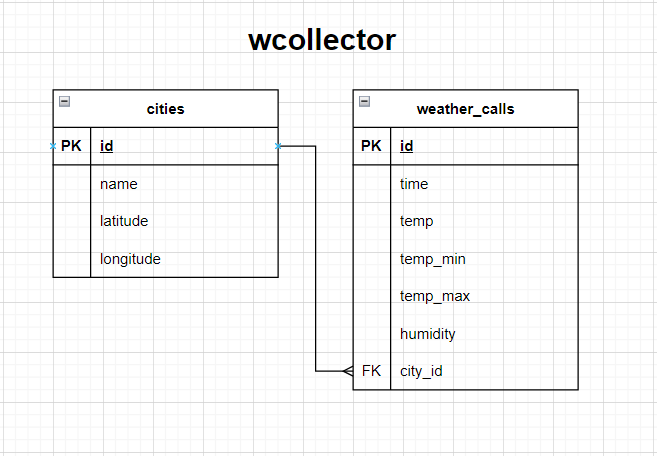

# Коллектор информации о погоде по городам

Коллектор собирает информацию о погоде в городах, указанных в предуставленном списке.
Информация по каждому запросу сохраняется в базе данных.
Приложение автоматически импортирует список необходимых город из *.csv файла, расположенного в корневом каталоге приложения и осуществляет запросы информации о погоде с использованием http://api.openweathermap.org.
___
## Используемые технологии
- Python 3.9
- PosgreSQL (опционально SQLite - для локального тестирования)
- Peewee 3.16.3 (ORM)
- Python-dotenv
___
## Структура базы данных.


___
## Как работает приложение?

**При первом запуске** приложение: 
1. Автоматически создает БД и необходимые таблицы:
   1. `cities` - таблица городов, по которым приложение направляет запросы информации о погоде, хранит 
   `name`, `latitude`(широта), `longitude`(долгота). 
   2. `weather_calls` - таблица запросов информации о погоде, хранит `time`, `temp`, `time_min`, `time_max`, `humidity`, `city_id`.
2. Автоматически импортирует список необходимым городов из `cities_list.csv` и наполняет таблицу cities.
   1. В `cities_list.csv` в стобце `name` указываются только названия городов на английском языке.  
   Приложение самостоятельно получает необходимые широту и долготу каждого города и наполняет таблицу.
   2. По умолчанию в cities_list.csv приведены 50 крупнейших городов мира.
   3. Количество городов не ограничено.

**При перезапуске приложения** приложение автоматически актуализирует список городов в соответствии с приведенным в cities_list.csv.

**При работе** каждый час собирает информацию о погоде в импортированных городах. Сохраняет информацию в БД.
___
## Запуск с использованием docker-compose

Приложение запускается в двух контейнера:
- `wcollector` - контейнер приложения
- `db` - контейнер базы данных.

### Порядок запуска

1. При необходимости, зарегистрироваться на https://openweathermap.org/api - для работы приложения понадобится API_KEY из личного кабинета.


2. Клонировать репозиторий:
```bash
git clone git@github.com:AlexanderPAI/weather_collector.git
```

3. В корневом каталоге приложения создать файл переменных окружения `*.env`.  
Пример `*.env`:
```
API_KEY=[API_KEY из личного кабинета https://openweathermap.org/api]
DB_NAME=postgres
POSTGRES_USER=postgres
POSTGRES_PASSWORD=1234
DB_HOST=db
PORT=5432
```
**!!! DB_HOST обязательно должен быть db, иначе контейнер приложения не сможет подключиться к БД !!!**

4. В корневом каталоге приложения запустить docker-compose
```bash
docker-compose up
```

5. Приложение совершит действия, указанные в разделе "Как работает приложение?" и начнет собирать данные в базу данных, запущенную в контейнере weather_collector-db-1
___
## Локальный запуск (с PostgreSQL)

1. При необходимости, зарегистрироваться на https://openweathermap.org/api - для работы приложения понадобится API_KEY из личного кабинета.


2. Клонировать репозиторий:
```bash
git clone git@github.com:AlexanderPAI/weather_collector.git
```

3. Создать базу данных PostgresSQL через pgAdmin или иную СУБД 


4. Создать и активировать виртуальное окружение
```bash
# для PowerShell на Windows
python -m venv venv
venv/Script/activate.bat

# для Bash на Ubuntu
python -m venv venv
source venv/bin/activate
```

5. Установить зависимости:
```bash
python -m pip install --upgrade pip
pip install -r requirements.txt
```

6. В корневом каталоге приложения создать файл переменных окружения `*.env`.  
Пример `*.env`:
```
API_KEY=[API_KEY из личного кабинета https://openweathermap.org/api]
DB_NAME=postgres
POSTGRES_USER=postgres
POSTGRES_PASSWORD=1234
DB_HOST=localhost
PORT=5432
```
**!!! DB_HOST обязательно должен быть localhost, иначе приложение не сможет подключиться к БД !!!**


7. В корневом каталоге приложения запустить `main.py`: 
```bash
python main.py
```

8. Приложение совершит действия, указанные в разделе "Как работает приложение?" и начнет собирать данные в соответствующую подключенную БД, указанную в `*.env`.
___
## Локальный запуск (с использованием SQLite для тестирования)

1. При необходимости, зарегистрироваться на https://openweathermap.org/api - для работы приложения понадобится API_KEY из личного кабинета.


2. Клонировать репозиторий:
```bash
git clone git@github.com:AlexanderPAI/weather_collector.git
```

3. Создать и активировать виртуальное окружение
```bash
# для PowerShell на Windows
python -m venv venv
venv/Script/activate.bat

# для Bash на Ubuntu
python -m venv venv
source venv/bin/activate
```

4. Установить зависимости:
```bash
python -m pip install --upgrade pip
pip install -r requirements.txt
```

5. В `models.py`:
```python
# строку
from connect_db import connect_to_postgre_db
# заменить на
from connect_db import connect_to_sqlite_db

# также строки
db = connect_to_postgre_db(
    db_name=getenv('DB_NAME'),
    db_user=getenv('POSTGRES_USER'),
    db_password=getenv('POSTGRES_PASSWORD'),
    db_host=getenv('DB_HOST'),
    db_port=getenv('DB_PORT')
)
# заменить на 
db = connect_to_sqlite_db()
```

6. В корневом каталоге приложения создать файл переменных окружения `*.env`.  
Пример `*.env`:
```
API_KEY=[API_KEY из личного кабинета https://openweathermap.org/api]
``` 
7. В корневом каталоге приложения запустить `main.py`: 
```bash
python main.py
```

8. Приложение совершит действия, указанные в разделе "Как работает приложение?" и начнет собирать данные в базу данных wcollector.db в корневом каталоге приложения.